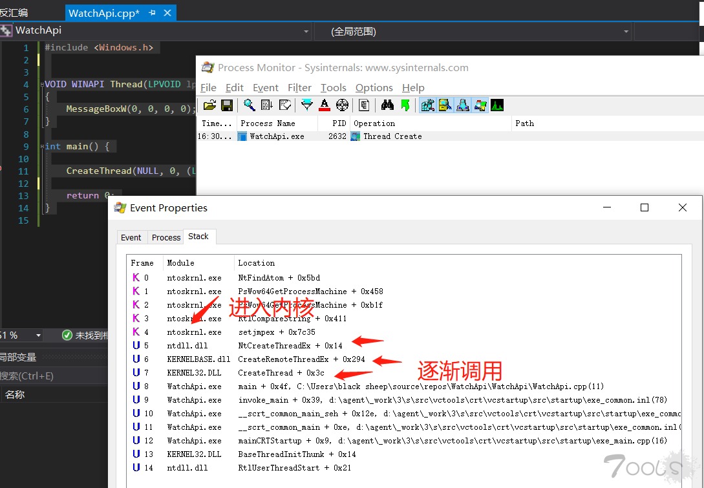
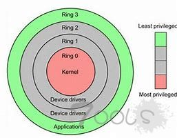
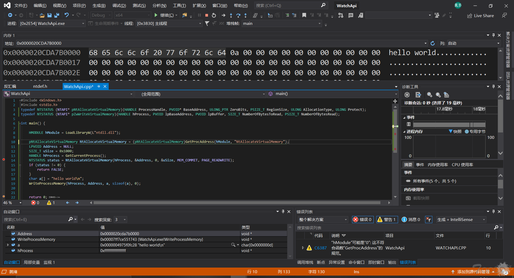
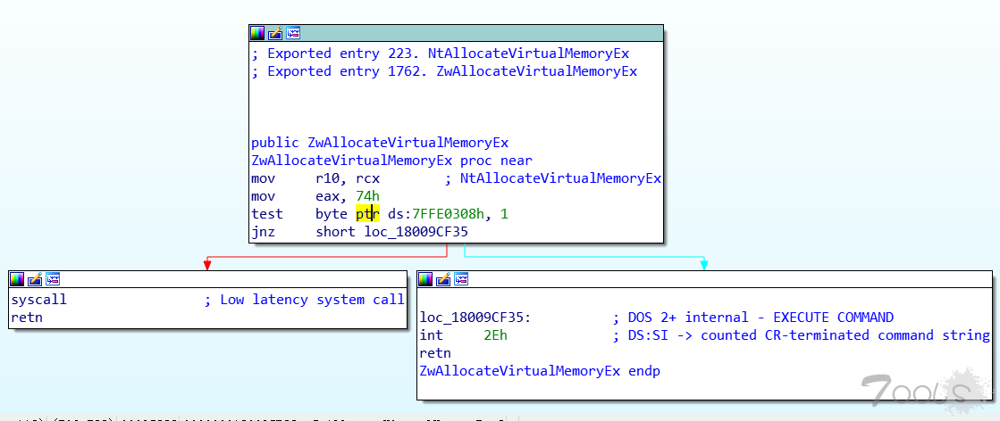
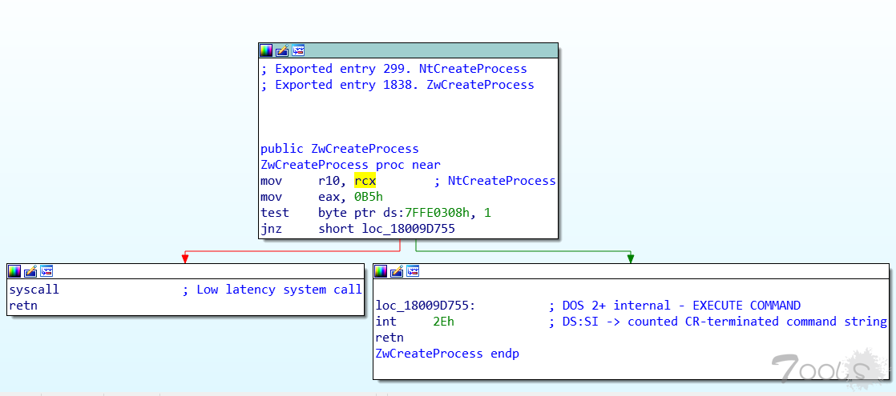
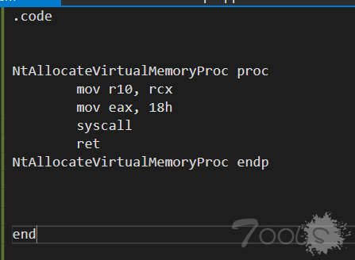
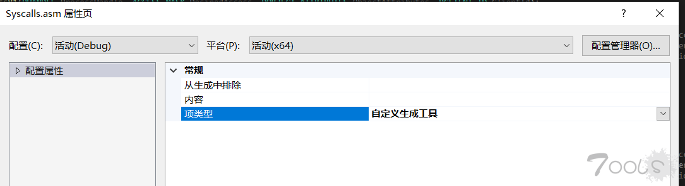
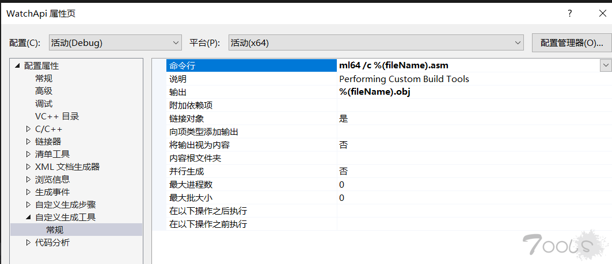
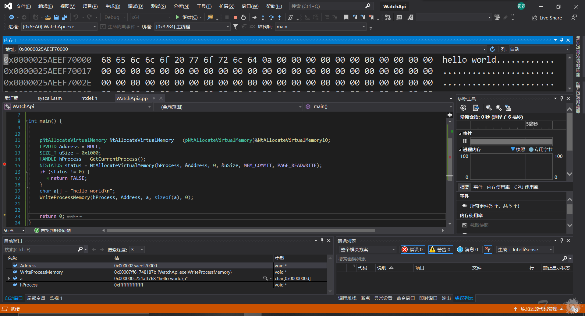

# 通过重写ring3 API函数实现免杀

> 这个是以前发在Tools的文章，不是我偷的！

> 在当前环境下，安全技术的防御能力逐渐变强，很多单纯的花式调用api也会被杀毒软件定义为恶意行为，同时杀毒软件也会通过hook用户层\(ring3\)函数的方式来捕捉api的调用，本文将介绍如何通过重写三环函数来实现杀毒软件的绕过。

### 分析windowsAPI调用过程

现在我们通过Process Monitor来观察一下Windows Api的调用过程，我们通过断点追踪的方式在函数调用前单独下一个断点，以便观察windows是如何调用api的。

```text
#include <Windows.h>


VOID WINAPI Thread(LPVOID lpParam)
{
    MessageBoxW(0, 0, 0, 0);
}

int main() {

    CreateThread(NULL, 0, (LPTHREAD_START_ROUTINE)Thread, 0, 0, 0);

    return 0;
}
```



我们发现createthread函数最终在进入内核前会调用ntdll.dll中的ntcreatethreadex函数，那我们是否能够直接调用该函数从而进行创建线程操作呢，我们接下来尝试一下。

### 寻找函数原型

在微软公开的文档内，我们找到函数原型和如下定义：

```text
typedef struct _UNICODE_STRING {
    USHORT Length;
    USHORT MaximumLength;
    PWSTR  Buffer;
} UNICODE_STRING, * PUNICODE_STRING;

typedef struct _OBJECT_ATTRIBUTES {
    ULONG           Length;
    HANDLE          RootDirectory;
    PUNICODE_STRING ObjectName;
    ULONG           Attributes;
    PVOID           SecurityDescriptor;
    PVOID           SecurityQualityOfService;
} OBJECT_ATTRIBUTES,*POBJECT_ATTRIBUTES;

//ntdll.dll 内函数均未公开
typedef DWORD(WINAPI* pNtCreateThreadEx)
(
    PHANDLE ThreadHandle,
    ACCESS_MASK DesiredAccess,
    POBJECT_ATTRIBUTES ObjectAttributes,
    HANDLE ProcessHandle,
    LPTHREAD_START_ROUTINE lpStartAddress,
    LPVOID lpParameter,
    BOOL CreateSuspended,
    DWORD dwStackSize,
    DWORD dw1,
    DWORD dw2,
    LPVOID Unknown
    );
```

找到参数结构体和函数原型后，我们构造函数指针用于直接调用该函数。

在此之前，我们需要先了解一下windows的系统底层设计，在dos系统年代，一个简单程序的报错就会引起整个系统的崩溃，这是因为系统运行在实模式\(real mode\)下，而在支持保护模式的cpu出现后，这个现象才得到缓解，保护模式引入了很多保护措施， 虚拟内存（Virtual Memory）和权限级别（Privilege Levels），就是其中最为典型的保护措施，在intel cpu设计时，一共设计了四个特权级别ring0-ring3，而在windows系统中，实际只使用两个特权级，ring0/ring3\(内核/用户\)。



前面我们发现绝大多数系统api最终都会进入到系统内核去执行，在内核中的操作本文不做介绍，接下来我们尝试一下直接调用用户层最后层函数来规避杀毒软件的监控。

```text
#include <Windows.h>
#include <stdio.h>
typedef NTSTATUS (NTAPI* pNtAllocateVirtualMemory)(HANDLE ProcessHandle, PVOID* BaseAddress, ULONG_PTR ZeroBits, PSIZE_T RegionSize, ULONG AllocationType, ULONG Protect);
typedef NTSTATUS (NTAPI* pZwWriteVirtualMemory)(HANDLE hProcess, PVOID lpBaseAddress, PVOID lpBuffer, SIZE_T NumberOfBytesToRead, PSIZE_T NumberOfBytesRead);

int main() {

    HMODULE hModule = LoadLibraryW(L"ntdll.dll");

    pNtAllocateVirtualMemory NtAllocateVirtualMemory = (pNtAllocateVirtualMemory)GetProcAddress(hModule, "NtAllocateVirtualMemory");
    LPVOID Address = NULL;
    SIZE_T uSize = 0x1000;
    HANDLE hProcess = GetCurrentProcess();
    NTSTATUS status = NtAllocateVirtualMemory(hProcess, &Address, 0, &uSize, MEM_COMMIT, PAGE_READWRITE);
    if (status != 0) {
       return FALSE;
    }
    char a[] = "hello world\n";
    WriteProcessMemory(hProcess, Address, a, sizeof(a), 0);


    return 0;
}
```



windows为了保证公开api的兼容性，所以对真正进入内核的函数进行了封装，以保证不同发行版的系统能用同样的代码调用同一个api，而真正进入内核的函数却不尽相同，这给编程开发人员便利的同时也方便了杀毒软件对此进行监控，假设更极端的情况，杀毒软件对用户层最下层\(ntdll.dll\)也进行了监控\(通常是inline hook\)，那我们要怎么规避这种检测呢？

### 分析三环函数

我们首先需要分析一下底层函数的实现。





在我们分析了几个函数之后，我们发现，几乎所有的ntapi实现都惊人的一致，在参数传入后，把系统调用号\(在内核寻找真正的处理函数使用\)保存至eax内，之后判断cpu是否支持快速调用，如果支持使用syscall进入内核，反之使用中断门进入内核，这两种方式除了使用不同的堆栈切换方式和效率外并未有其他本质区别\(本文不做介绍\)，接下来我们的思路也比较清晰了，我们自己手工重写ring3函数，从而绕过杀毒软件的检测:



定义上图汇编文件，添加下图编译选项，添加参与编译，我们使用快速调用进入内核。





```text
#include <Windows.h>
#include <stdio.h>

EXTERN_C NTSTATUS NTAPI NtAllocateVirtualMemoryProc(HANDLE ProcessHandle, PVOID* BaseAddress, ULONG_PTR ZeroBits, PSIZE_T RegionSize, ULONG AllocationType, ULONG Protect);
typedef NTSTATUS (NTAPI* pNtAllocateVirtualMemory)(HANDLE ProcessHandle, PVOID* BaseAddress, ULONG_PTR ZeroBits, PSIZE_T RegionSize, ULONG AllocationType, ULONG Protect);
//typedef NTSTATUS (NTAPI* pZwWriteVirtualMemory)(HANDLE hProcess, PVOID lpBaseAddress, PVOID lpBuffer, SIZE_T NumberOfBytesToRead, PSIZE_T NumberOfBytesRead);

int main() {


    pNtAllocateVirtualMemory NtAllocateVirtualMemory = &NtAllocateVirtualMemoryProc;
    LPVOID Address = NULL;
    SIZE_T uSize = 0x1000;
    HANDLE hProcess = GetCurrentProcess();
    NTSTATUS status = NtAllocateVirtualMemory(hProcess, &Address, 0, &uSize, MEM_COMMIT, PAGE_READWRITE);
    if (status != 0) {
       return FALSE;
    }
    char a[] = "hello world\n";
    WriteProcessMemory(hProcess, Address, a, sizeof(a), 0);


    return 0;
}
```



这样我们就自己重写3环的api，因为是我们程序内定义的，所以杀毒软件\(用户态\)无法监控我们使用了api，下面就由大家自由发挥。  


