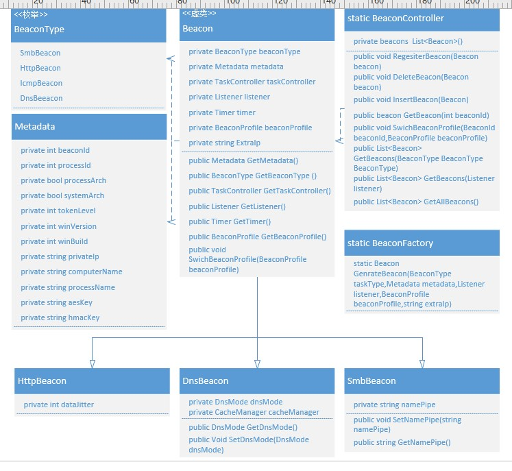
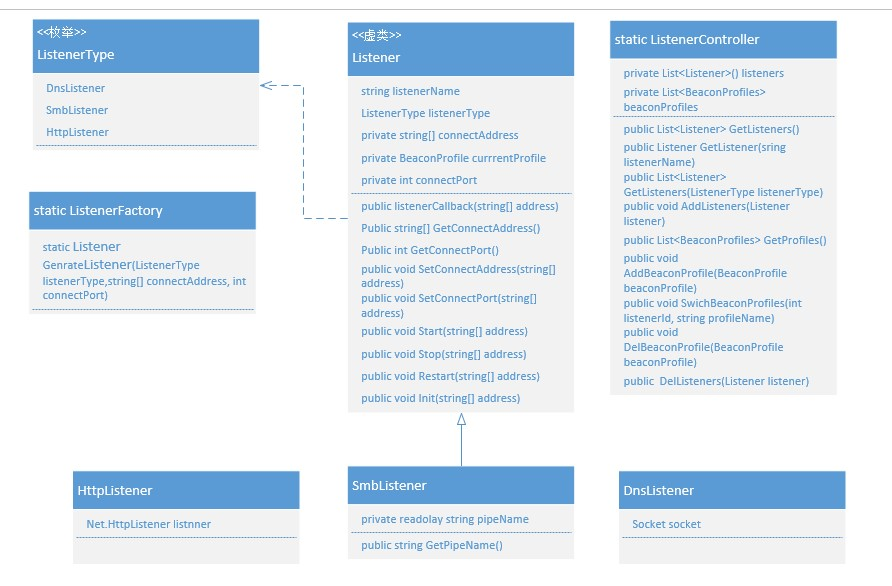

# 真·手稿

## 手写搞

### 心跳


### 数据流


### 处理逻辑


## 初期UML图

在设计初期把创建和管理功能区分开,实际在实现的时候发现有功能高度重合统一整合到Controller里面了。

### Tasks


### Beacons



### Listeners



### Profiles

设计的时候是准备自己写解析引擎的，后来在实现的时候发现json能直接反序列化成对象,后续准备直接从json封装profile。

```text
string profile_name "profilename"
int sleep_time  30
int sleep_jitter 30
string useragent "userAgent"

http_profile:
    cecerrtificate:
        string C "US"
        string CN "jquery.com"
        string O "jQuery"
        string OU "Certificate Authority"
        string validity "365"
    server_general:
        set headers "Date, Server, Content-Length, Keep-Alive, Connection, Content-Type";
        headers:
            "Server" "Apache";

        block_useragents "curl*,lynx*,wget*";
    task_config:
        client:
            task_result_url "/rooke.api"
            task_result_null "GET"
            task_result_put "POST"
            headers:
                cookie "lalalalla"
            metadata:
                coding base64
                header "cookie"
                prepend "__cfduid=";
                append "__cfduid=";
                
        server:
            task_request_null 302
            task_request_put 200
            headers:
                set-cookie "lalalalla"
            output:
                coding base64
                prepend 12345
                append "__cfduid="


tcp_profile:
    string tcp_port 42585
    string tcp_frame_header "\x80"

smb_profile:
    string pipename "mojo.5688.8052.183894939787088877##"
    string pipename_stager "mojo.5688.8052.35780273329370473##"
    bytes smb_frame_header "\x80"

dns_profile:
    string dns_idle           "74.125.196.113"
    int dns_max_txt        "252"
    int dns_sleep          "0"
    int dns_ttl            "5"
    int maxdns             "255"
    string dns_stager_prepend ".resources.123456."
    string dns_stager_subhost ".feeds.123456."
    string beacon           "a.bc."
    string get_A            "b.1a."
    string get_AAAA         "c.4a."
    string get_TXT          "d.tx."
    string put_metadata     "e.md."
    string put_output       "f.po."
    string ns_response      "zero"

ssh_profile:
    ssh_banner        "OpenSSH_7.4 Debian (protocol 2.0)"
    ssh_pipename      "wkssvc##"

stager_profile:
    string url "/jquery-3.3.1.slim.min.js"
    string check_over "faske"
    client:
        headers:
            string cookie "hello"
    server:
        headers:
            string set_cookie "fake-----"
        output:
            string prepend "nihao"
            string append "nohao"

post_profile:
    string spawnto_x86 "%windir%\\syswow64\\dllhost.exe"
    string spawnto_x64 "%windir%\\sysnative\\dllhost.exe"
    string keylogger "GetAsyncKeyState";
    string pipename "Winsock2\\CatalogChangeListener-###-0,"
    string allocator "NtMapViewOfSection"
    int min_alloc 25500
    string transform "\x90\x90"
    execute:
        CreateRemoteThread
        RtlCreateUserThread
        NtQueueApcThread-s
        CreateThread

pe_profile:
    string pe_name "hello"
    string allocator  "VirtualAlloc"
    string magic_mz   "MZRE";
    string magic_pe   "NO"
    bool stomppe "true"
    int checksum 0
    string compile_time
    string entry_point
    string image_size
    string rich_header "\x55\x55"

    transform:
        string prepend "\x55\x55\x55"
        string append "\x55\x55\x55"
        strrep:
            "AAA" "BBB"
            "AAA" "BBB"
```

#### 实现

```text
{
    "ProfileName":"TestProfile",
    "SleepTime":60,
    "SleepJitter":30,
    "UserAgent":"Uset Agent",
    "Http":{
      "Server": {
        "Headers": {
          "serverheader": "serverheader"
        },
        "Status": 404,
        "Body": "<!DOCTYPE HTML PUBLIC \"-//IETF//DTD HTML 2.0//EN\">\n<html><head>\n<title>Tom fuck fbi 404 Not Found</title>\n</head><body>\n<h1>Not Found</h1>\n<p>The requested URL #URI# was not\nfound on this server.</p>\n</body></html>",
        "TaskRequest": {
          "Null": 201,
          "Put": 200,
          "Coding": "base64",
          "Prepend": "prepend",
          "Append": "append"
        }
      },
        "Client":{
            "Headers":
            {
                "Clientheader":"clientheader"
            },
            "TaskResult":{
                "Uri":"/rooke.api",
                "Null":"GET",
                "Put":"POST",
                "Coding":"base64",
                "Append":"append",
                "Prepend":"prepend"
            },
            "Metadata":{
                "Coding":"base64",
                "Header":"Cookie",
                "Append":"append",
                "Prepend":"prepend"
            }
        }
    }
}
```

