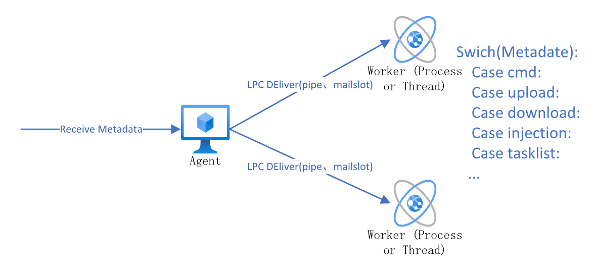

# C2手稿

## 简介

C2是个啥玩意我就不赘述了,放一些设计初期的手稿,希望能对大家有所帮助。

## 第一章 设计理念

### 1.设计模型

该C2采用Client-Teamserver-Agent设计,其中Agent为汇编、C实现,而Teamserver与Client使用C\#实现。

Agent部分以RDI技术为核心扩展,采用Fork&Run思想设计,即傀儡进程注入RDI反射DLL,这样做的好处在于Agent从设计上规避了这块使用内存的回收问题，同时提高了RDI模块本身的容错,但这样设计同样存在不小的缺陷,从OPSEC的角度来说,这种设计不是特别合适,所以我们同时还要提供一种相对于Fork&Run更难以检测的模式,作者选用Master-Worker模式,Worker以抢占式的执行Master分配的任务。

TeamServer与Client均为C\#编写,出于对使用者的体验考虑,故设计成与CS\(Cobaltstrike下文若非特指均称为CS\),Client与Teamserver之间采用ASP.NET的WEB Api进行数据交互,与Agent之间使用自建WEB Server或Raw Socket进行交互,数据格式参考cobaltstrike,将Channel\(信道,即数据的传输方式\)与Metadata\(元数据,即Agent的操作指令\)解耦合,即信道与元数据分离,同时在数据传输过程中使用RSA+AES的强加密\(在信道中实现\)。

具体细节会在后续章节正文中讲解。

### 2.概念图

#### 2.1 Agent

#### 2.2 TeamServcer

